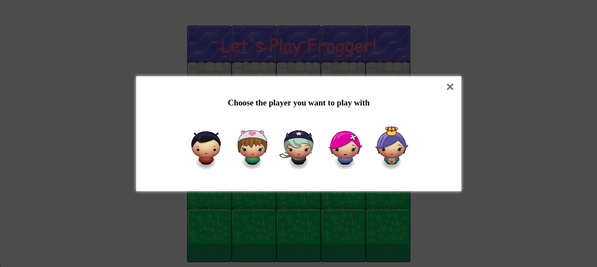
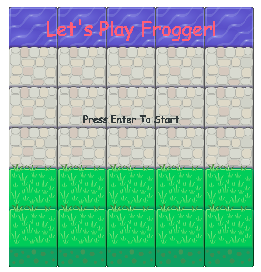
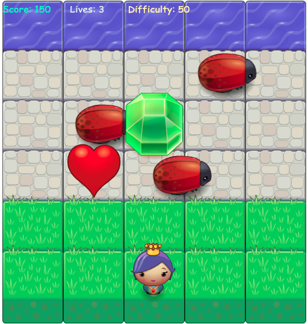
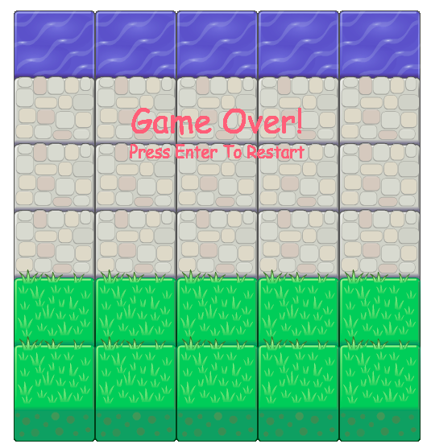

frontend-nanodegree-arcade-game
===============================

## How to play:

1. choose Your player.

2. Press enter to start the game.

3. Use the arrow keys to move.

4. The objective is to reach the top of the water and collect gems to score.
5. Each time you reach the top of the water, difficulty increases.
6. Collect hearts to gain extra lives.
7. Avoid the bugs, they kill you. You start with three lives.

## Scoring

No gem is worth 10 point.

The blue gem is worth 100 points.

The green gem is worth 50 points.

The orange gem is worth 30 points.

The Heart is worth 1 player Lives.

If you collide with an enemy, your lives score decreases by - 1.

If you have 0 in your lives score, you will lose the game
